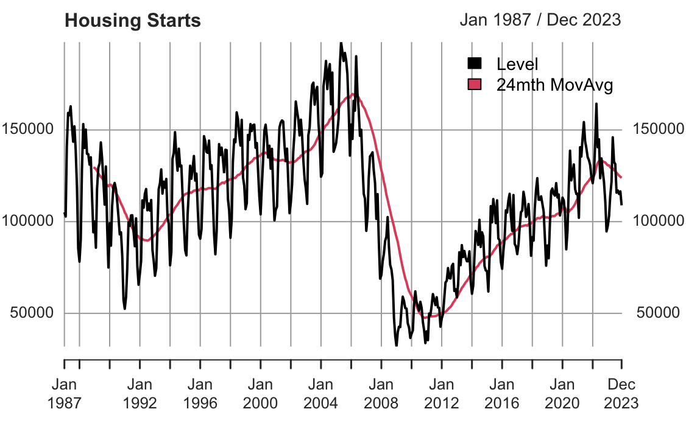
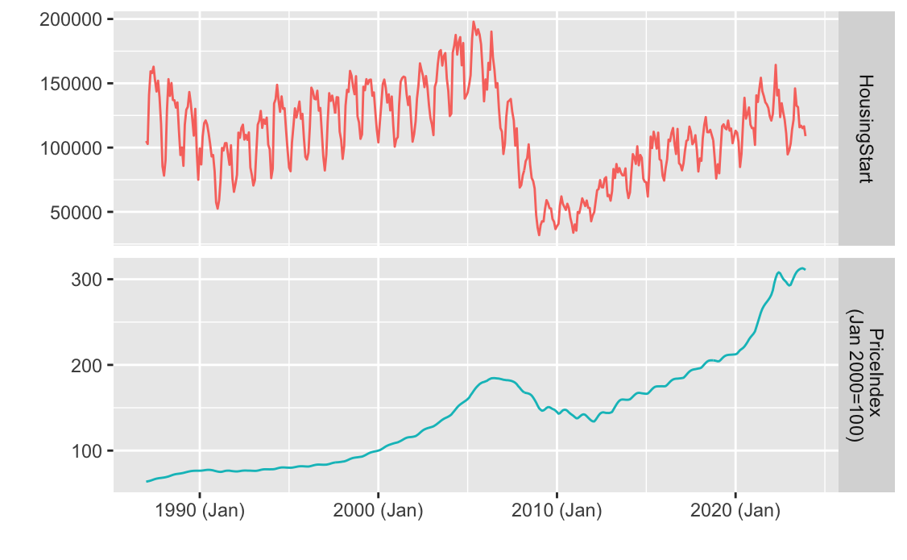
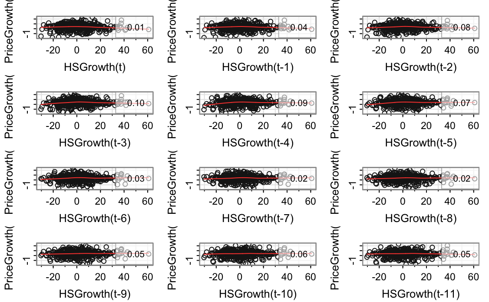
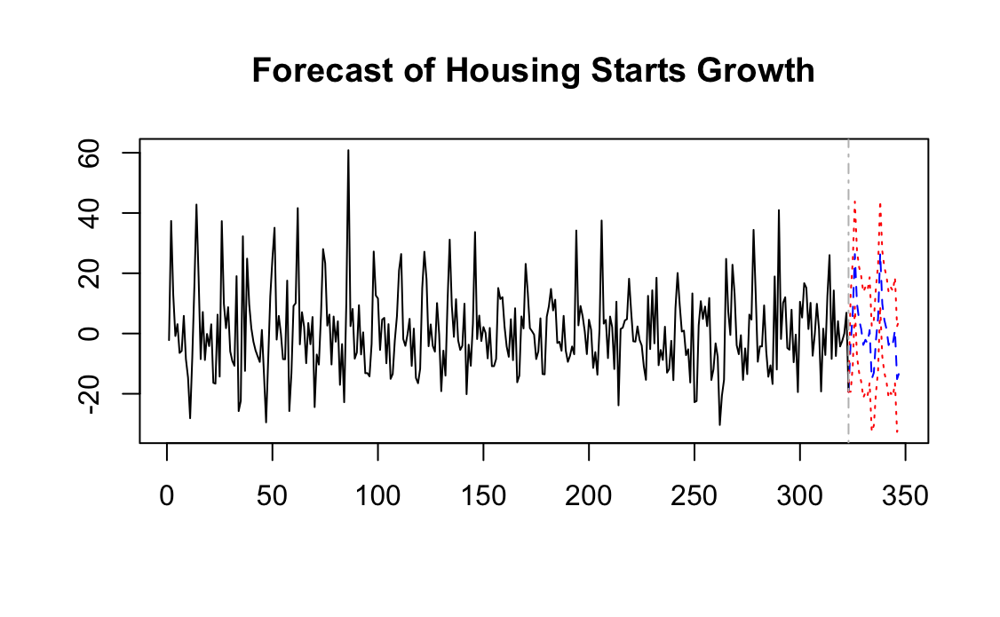

# Housing Price Forecasting via Time Series & VAR Analysis

**Tools:** R · Quarto · Time Series Forecasting · VAR · FRED API · fredr · dplyr · ggplot2

---

## Business Problem

Housing markets are heavily influenced by macroeconomic conditions, supply trends, and long-term market cycles. This project analyzes historical housing price growth and housing starts to better understand market relationships and improve forecasting accuracy.

The objective was to evaluate how housing supply activity relates to national housing price trends using both univariate and multivariate time series techniques.

---

## Project Approach

- Retrieved economic data directly from the Federal Reserve Economic Data (FRED) API
- Analyzed:
  - S&P/Case-Shiller U.S. National Home Price Index
  - U.S. Housing Starts
- Cleaned and transformed monthly economic time series data
- Conducted exploratory trend and stationarity analysis
- Applied decomposition and forecasting workflows
- Built Vector Autoregression (VAR) models to analyze dynamic relationships between variables
- Used Quarto and R Markdown for reproducible analytical reporting

---

## Data Sources

Data obtained from the Federal Reserve Economic Data (FRED) database:

| Series ID | Description |
|---|---|
| `CSUSHPINSA` | S&P/Case-Shiller U.S. National Home Price Index |
| `HOUSTNSA` | New Privately-Owned Housing Units Started |

Source: https://fred.stlouisfed.org/

---

## Analytical Focus Areas

- Time series forecasting
- Housing market trend analysis
- Economic indicator analysis
- Vector Autoregression (VAR)
- Seasonality decomposition
- Forecasting with multiple variables
- Reproducible analytical reporting

---

## Project Visuals

### Housing Starts Trend Analysis

Historical housing starts activity showing long-term cyclical movement and market disruptions.



---

### Housing Market & Price Index Comparison

Comparison of housing starts and national housing price index behavior over time.



---

### Additive Time Series Decomposition

Decomposition of trend, seasonality, and residual components within the housing market time series.


---

### Growth Index & Lag Analysis

Lagged relationship analysis between housing starts growth and housing price growth.



---

### Housing Growth Forecasting

Forecasted housing starts growth using time series forecasting techniques.



---

### Seasonal Pattern Analysis

Visualization of recurring seasonal behavior within housing market activity.

.png)

---

## Repository Structure

```text
data/        -> downloaded or processed datasets
Images/      -> charts and forecasting visuals
notebooks/   -> Quarto and R Markdown analytical workflows
reports/     -> exported PDF project reports
```

---

## Files

| File | Description |
|------|-------------|
| `notebooks/housing_price_timeseries.qmd` | Quarto workflow for housing price forecasting and VAR analysis |
| `notebooks/housing_price_timeseries.rmarkdown` | R Markdown version of the project |
| `reports/` | Exported reports and final outputs |

---

## Portfolio

Portfolio Website: https://cameronbatts.github.io/

GitHub Profile: https://github.com/cameronbatts
